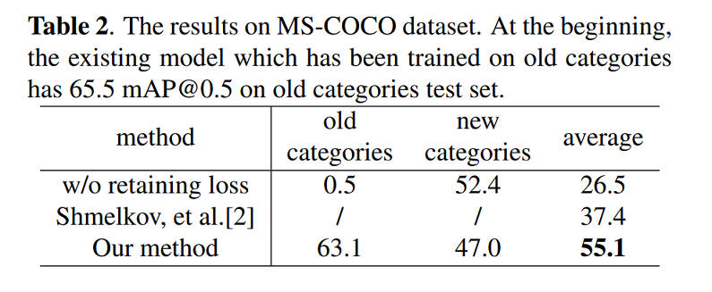

# Incremental Object Detection with Feature Pyramid Network(FPN) and Knowledge Distillation

Adding new classes to existing CNN model. For example, a model can recognize first 40 classes in MS-COCO dataset(this dataset contains 80 classes total). This work can train this model to recognize other 40 classes, and still has ability to recognize the first 40 classes.
 
The pdf file in this repo is my master thesis.

Related paper: Chen J, Wang S, Chen L, Cai H, and Qian Y. Incremental Detection of Remote Sensing Objects with Feature Pyramid and Knowledge Distillation[J]. IEEE Transactions on Geoscience and Remote Sensing, 2020.


The “target-after-sigmoid-distill-loss” folder is the train code in the condition of RPN use smoothL1 loss after sigmoid, and CLS use distill loss. Other conditions can be easily got with small modification on loss function and the position of loss function. 


The “test-oldC” and “test-newC” folder are for testing, i.e. getting mAP on test dataset.


## Accuracy




[2] K. Shmelkov, C. Schmid, and K. Alahari, "Incremental learning of object detectors without catastrophic forgetting," in 2017 IEEE International Conference on Computer Vision (ICCV), Oct 2017, pp. 3420–3429.

## Experiment environment

CentOS 7 or Ubuntu>=14.04;	python2.7;	2 GPUs (One GPU's memory should larger than 8GB, the other one should larger than 6GB.)

PyTorch with the version released between 2018.10.1-2018.10.30, and should be compiled from source. (Because some ops written by detectron authors are not contained in PyTorch python .whl file.)	

Note: don't install detectron with "python setup.py", because we will run multiple different detectrons with adaptation.


## Prepare to train

Install memcached on its offical website(http://memcached.org/).

after installed, run it:

```
memcached -p 11212 -m 2048m -I 64m -d
```


## Train

Open a terminal and tap:

```
export CUDA_VISIBLE_DEVICES=0

cd freeze

make && python ./tools/train_net.py --cfg e2e_faster_rcnn_R-50-FPN_2x.yaml --skip-test OUTPUT_DIR where_you_want_to_save_output_model
```

and wait 30 seconds...


&nbsp;


Open another terminal and tap:
```
export CUDA_VISIBLE_DEVICES=1

cd train

make && python ./tools/train_net.py --cfg e2e_faster_rcnn_R-50-FPN_2x.yaml --skip-test OUTPUT_DIR where_you_want_to_save_output_model

```

## Test

When you want to test old category mAP:
```
cd test-oldC

make && python tools/test_net.py --cfg e2e_faster_rcnn_R-50-FPN_2x.yaml TEST.WEIGHTS the_absolute_path_to_your_model OUTPUT_DIR where_you_want_to_save_test_result
```


&nbsp;


When you want to test new category mAP:
```
cd test-newC

make && python tools/test_net.py --cfg e2e_faster_rcnn_R-50-FPN_2x.yaml TEST.WEIGHTS the_absolute_path_to_your_model OUTPUT_DIR where_you_want_to_save_test_result
```


## Information
The code based on Detectron with the version: after the commit at Nov 8, 2018. (<https://github.com/facebookresearch/Detectron/tree/8181a324796202e4afe7660b7458b7bf1e08cf8b>) 


## Related paper

Chen J, Wang S, Chen L, Cai H, and Qian Y. Incremental Detection of Remote Sensing Objects with Feature Pyramid and Knowledge Distillation[J]. IEEE Transactions on Geoscience and Remote Sensing, 2020.


